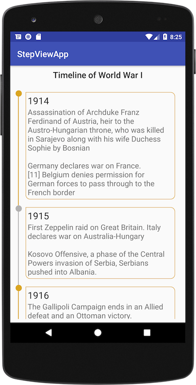
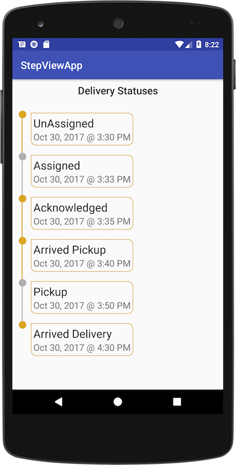
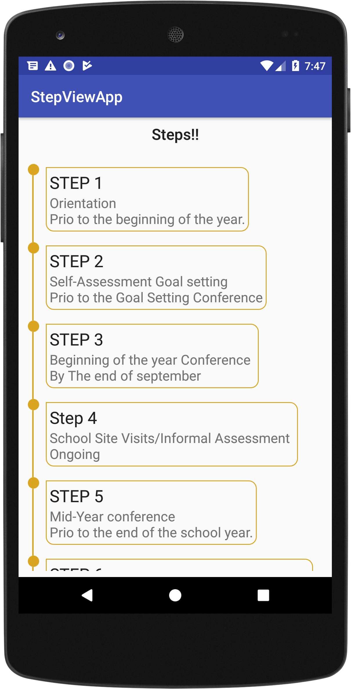

# TimeLineView 
Android Timeline View Library demonstrate the the power of ConstraintnLayout and RecyclerView.


[](https://jitpack.io/#po10cio/TimeLineView)
[](https://github.com/po10cio/TimeLineView/blob/master/LICENSE.md) 


## Showcase

&nbsp;&nbsp;&nbsp;&nbsp;&nbsp;
&nbsp;&nbsp;&nbsp;&nbsp;&nbsp;



## Quick Setup
### 1. Include library

**Using Gradle**

TimelineView is currently available in on Jitpack so add the following line before every other thing if you have not done that already.

```gradle
allprojects {
  repositories {
    ...
    maven { url 'https://jitpack.io' }
  }
}
```
	
Then add the following line 

``` gradle
dependencies {
  compile 'com.github.po10cio:TimeLineView:1.0.0'
}
```

**Using Maven**

Also add the following lines before adding the maven dependency

```maven
<repositories>
  <repository>
    <id>jitpack.io</id>
    <url>https://jitpack.io</url>
  </repository>
</repositories>
```
Then add the dependency

``` maven
<dependency>
  <groupId>com.github.po10cio</groupId>
  <artifactId>TimeLineView</artifactId>
  <version>1.0.0</version>
</dependency>
```

### 2. Usage
In your XML layout include the TimelineView as follows:

```xml
<me.jerryhanks.stepview.TimeLineView
  android:id="@+id/timelineView"
  android:layout_width="match_parent"
  android:layout_height="match_parent"
  android:layout_marginBottom="8dp"
  android:layout_marginLeft="8dp"
  android:layout_marginRight="8dp"
  android:layout_marginTop="16dp">
      
```
Then in your Kotlin code, do the following:
 
 **Create a class that extends TimeLine**
 
```kotlin
class MyTimeLine(status: Status, var title: String?, var content: String?) : TimeLine(status) {
  override fun equals(other: Any?): Boolean {
    if (this === other) return true
    if (javaClass != other?.javaClass) return false
        other as MyTimeLine
    
    if (title != other.title) return false
    if (content != other.content) return false

    return true
  }
  
  override fun hashCode(): Int {
    var result = if (title != null) title!!.hashCode() else 0
    result = 31 * result + if (content != null) content!!.hashCode() else 0
    
    return result
  }

  override fun toString(): String {
    return "MyTimeLine{" +
      "title='" + title + '\'' +
      ", content='" + content + '\'' +
      '}'
  }
}
```
  
  
TimeLine has three Statuses:

- Status.COMPLETED
- Status.UN_COMPLETED
- Status.ATTENTION

You can choose from any of the statuses depending on the status of the item you want to represent.

**Create an Array of your TimeLine**

```kotlin
 val timeLines = mutableListOf<MyTimeLine>()
  .apply {
    add(MyTimeLine(Status.COMPLETED, getString(R.string.s_title_1), getString(R.string.s_content_1)))
    add(MyTimeLine(Status.COMPLETED, getString(R.string.s_title_2), getString(R.string.s_content_2)))
    add(MyTimeLine(Status.COMPLETED, getString(R.string.s_title_3), getString(R.string.s_content_3)))
    add(MyTimeLine(Status.COMPLETED, getString(R.string.s_title_4), getString(R.string.s_content_4)))
    add(MyTimeLine(Status.COMPLETED, getString(R.string.s_title_5), getString(R.string.s_content_5)))
    add(MyTimeLine(Status.COMPLETED, getString(R.string.s_title_6), getString(R.string.s_content_6)))
    add(MyTimeLine(Status.COMPLETED, getString(R.string.s_title_7), getString(R.string.s_content_7)))
  }
```

**Create the IndicatorAdapter and add it to the TimeLineView**

```kotlin
  val adapter = IndicatorAdapter(mutableListOf(), this, object : TimeLineViewCallback<MyTimeLine> {
    override fun onBindView(model: MyTimeLine, container: FrameLayout, position: Int): View {
      val view = layoutInflater
        .inflate(R.layout.sample_time_line,
        container, false)
       
      (view.findViewById<TextView>(R.id.tv_title)).text = model.title
      (view.findViewById<TextView>(R.id.tv_content)).text = model.content
     
      return view
    }
  })

  timelineView.setIndicatorAdapter(adapter)
  adapter.swapItems(timeLines)
```

**IndicatorAdapter**
This extends RecyclerView.Adapter and exposes the following functions:

- Swaps the old items with the new items
```kotlin
  fun swapItems(timeLines: List<T>)
```

- Update a single item given the index
```kotlin
  fun updateItem(timeline: T, position: Int) 
```

- Adds a list of items to the list
```kotlin
  fun addItems(vararg items: T)
```
	
## Changelog

See the [changelog](/CHANGELOG.md) file.


## License

TimeLineView is distributed under the MIT license. [See LICENSE](https://github.com/po10cio/TimeLineView/blob/master/LICENSE.md) for details.
